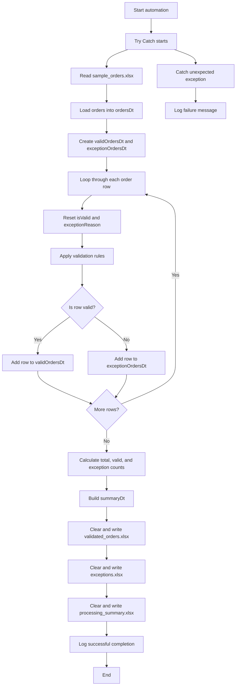
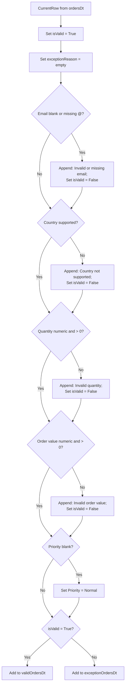
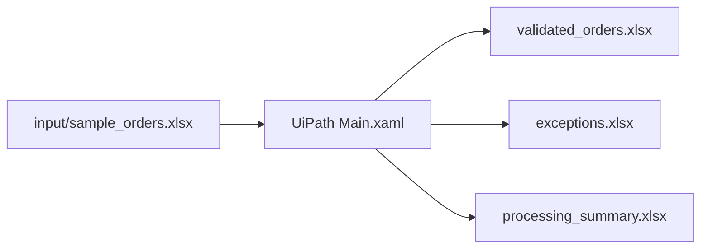
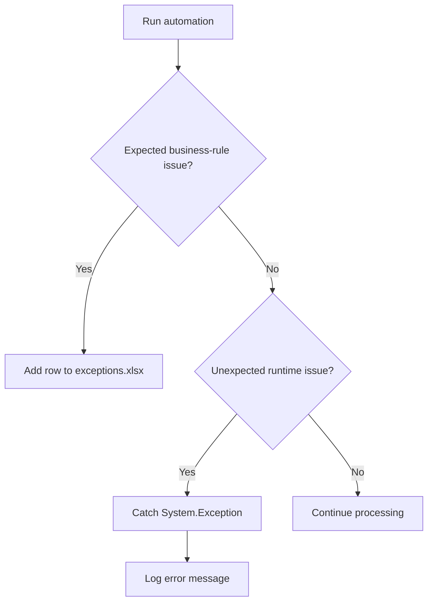
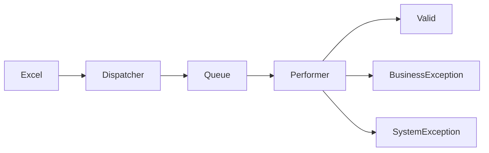
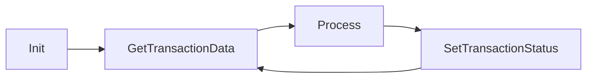

# Process diagrams

This file contains the workflow diagrams for the RPA Order Intake Validator project.

---

# Version 1 – Validator

## High-level automation flow

## Row validation flow

## Input and output data flow

## Exception handling model

Business exceptions are expected validation failures, such as missing email or invalid quantity. Runtime exceptions are unexpected technical problems, such as a missing file, locked workbook, or corrupted Excel structure.

---

# Version 2 – Enterprise Solution

---

# REFramework Transaction Lifecycle

